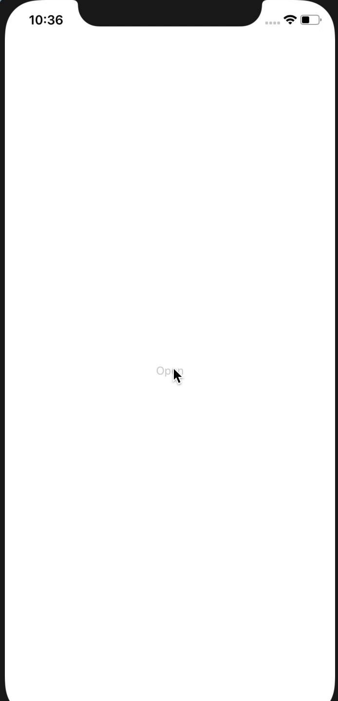

<div align="center">
	
</div>

# react-native-side-drawer

[](https://npmjs.org/package/react-native-side-drawer)
[](http://makeapullrequest.com)
[](https://github.com/pedreviljoen/react-native-menu/blob/master/LICENSE)
[](https://npmjs.org/package/react-native-side-drawer) [](https://greenkeeper.io/)

> Simple & lightweight side menu drawer

## Contents

  - [Contents](#contents)
  - [Install](#install)
  - [Usage](#usage)
  - [Props](#props)
  - [Contribute](#contribute)
  - [License](#license)

## Install

```sh
yarn install react-native-side-drawer
```

OR

```sh
npm install react-native-side-drawer
```

## Usage

```javascript
import React from 'react'
import { View, Text, StyleSheet, TouchableOpacity } from 'react-native'
import MenuDrawer from 'react-native-side-drawer'

class Example extends React.Component {

    render() {
        return(
            <View style={styles.container}>
                <MenuDrawer 
                    open={this.state.open}
                    containerStyle={styles.containerStyle}
                >
                    <TouchableOpacity onPress={this.toggleOpen}>
                        <Text>
                            Close
                        </Text>
                    </TouchableOpacity>
                </MenuDrawer>
                <TouchableOpacity onPress={this.toggleOpen}>
                    <Text>
                        Open
                    </Text>
                </TouchableOpacity>
            </View>
        )
    }
}

const styles = StyleSheet.create({
    containerStyle: {
        // some custom styling
    },
})
```

## Props

<table width="80%">
    <tr>
        <th>Property</th>
        <th>Description</th> 
        <th>Default Value</th>
    </tr>
    <tr>
        <td><code>containerStyle</code></td>
        <td>Styles of item container</td> 
        <td><code>{}</code></td>
    </tr>
    <tr>
        <td><code>open</code></td>
        <td>Boolean value toggling open and close of drawer</td> 
        <td><code>false (closed)</code></td>
    </tr>
</table>

## Contribute

Contributions are welcome!

1. Fork it.
2. Create your feature branch: `git checkout -b my-new-feature`
3. Commit your changes: `git commit -am 'Add some feature'`
4. Push to the branch: `git push origin my-new-feature`
5. Submit a pull request :D

Or open up [a issue](https://github.com/pedreviljoen/react-native-menu/issues).

## Coming soon

- [x] iOS SafeArea support
- [ ] Custom width of drawer
- [ ] Opacity fade of background screen

## License

MIT